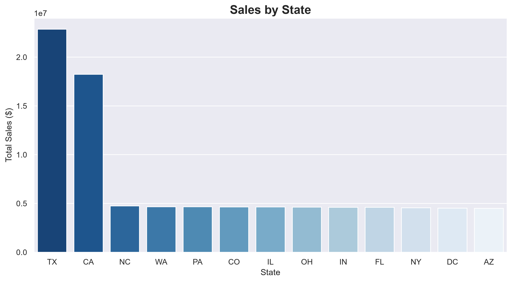
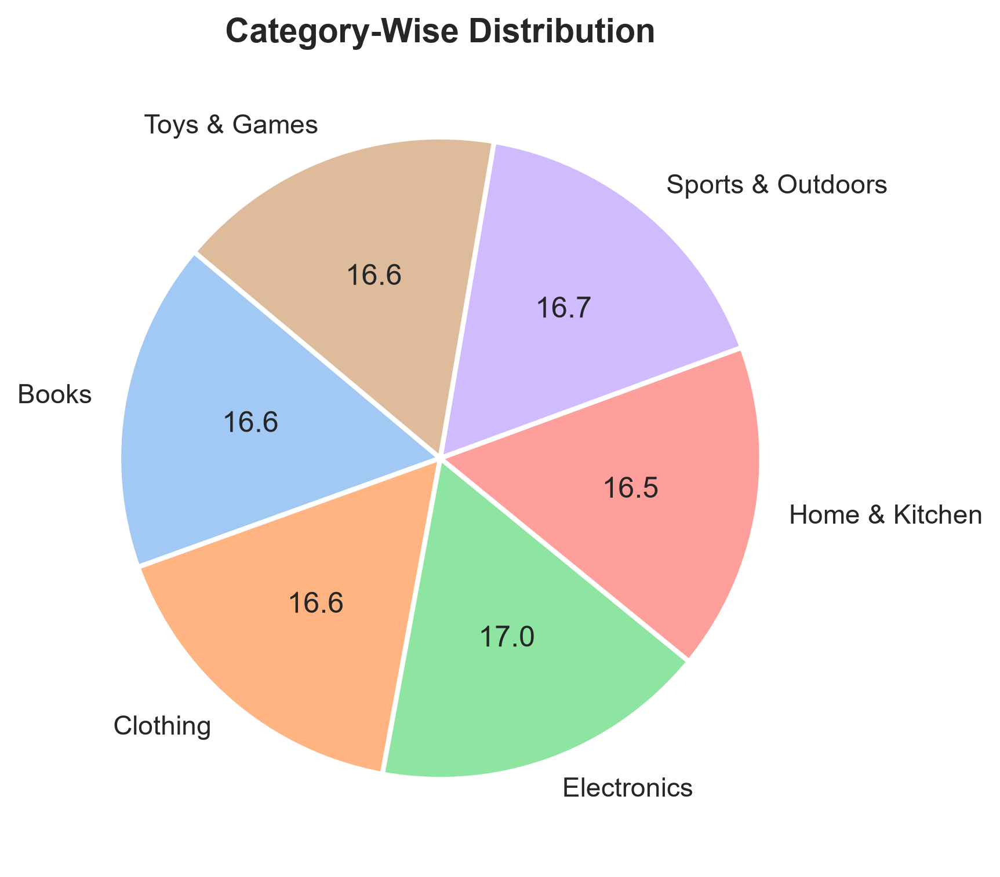
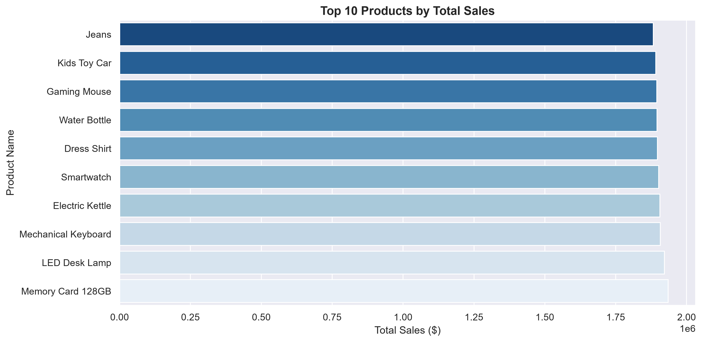

# Amazon Sales Performance & Profitability Analysis

[](https://colab.research.google.com/github/OpokuManuel/Amazon_Sales_Analysis/blob/main/Amazon_Sales_Analysis.ipynb)
[](https://opensource.org/licenses/MIT)
[](https://www.python.org/downloads/)

An end-to-end Exploratory Data Analysis (EDA) on a dataset of **100,000 e-commerce transactions** designed to uncover high-impact sales drivers, regional purchasing behaviors, and operational profitability metrics.

---

## Executive Summary
In e-commerce, top-line revenue is only half the story. This project dives beneath surface-level metrics to analyze product performance, payment success trends, and geographic distributions. By connecting transaction volume to net profit margins and analyzing order fulfillment statuses, this analysis delivers actionable business insights aimed at maximizing margins and plugging revenue leakage.

### Core Business Questions Addressed:
1. **Profit Efficiency:** Which product categories and sub-categories are generating high revenue versus those delivering superior profit margins?
2. **Operations & Logistics:** What percentage of overall revenue is actively lost to cancellations and returns?
3. **Regional Demographics:** How do payment preferences and average order values (AOV) shift across international markets?

---

## Visual Gallery (Key Insights)
*Here are some of the key visualizations generated during the analysis:*

### 1. Sales Performance by State

*Insight: Highlights which State dominate top-line revenue versus transactional volume.*

### 2. Sales by Product Category

*Insight: Shows percentage Distribution of products based on categories.*

### 3. Order Status Tracking

*Insight: Identifies the top 10 products based on revenue generated from sales.*

---

## Tech Stack & Libraries
- **Language:** Python
- **Data Manipulation:** Pandas, NumPy
- **Visualizations:** Matplotlib, Seaborn
- **Environment:** VS Code / Windows OS / Google Colab

---

## Key Insights & Strategic Takeaways

*   **Revenue vs. Profitability:** While high-volume categories drive the bulk of top-line sales, specific smaller categories maintain significantly higher **Profit Margin %**, presenting a prime marketing optimization opportunity.
*   **Operational Leakage:** A critical proportion of transactions are flagged under "Cancelled" or "Returned" statuses. Addressing this supply-chain bottleneck could recover substantial revenue.
*   **Payment & Localization:** Payment method performance varies heavily by country, suggesting that optimizing checkout payment options per region can directly decrease cart abandonment.

---

## Project Structure
```text
├── Amazon.csv              # Raw transaction dataset (100,000 rows)
├── practice copy.ipynb    # Documented Jupyter Notebook with EDA and visualizations
├── images                 # Exported chart visualizations from notebook
└── README.md               # Project documentation & execution guide
```
---

## How to Run This Project Locally

### 1. Clone the Repository
git clone [https://github.com/](https://github.com/)OpokuManuel/Amazon_Sales_Analysis.git
cd Amazon_Sales_Analysis

### 2. Install Dependencies
pip install pandas matplotlib seaborn

### 3. Open the Notebook
Run your Jupyter environment locally to explore the codebase:
jupyter notebook Amazon_Sales_Analysis.ipynb

##  Author

- **Opoku Emmanuel Atta** - [LinkedIn](https://www.linkedin.com/in/opoku-emmanuel-atta/) | [GitHub Portfolio](https://github.com/OpokuManuel)
- **Academic Focus:** Computer Science Student, Data Analysis

